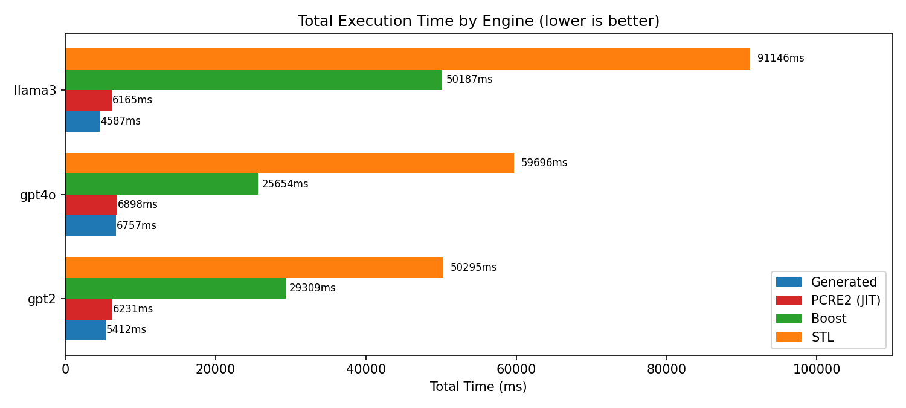
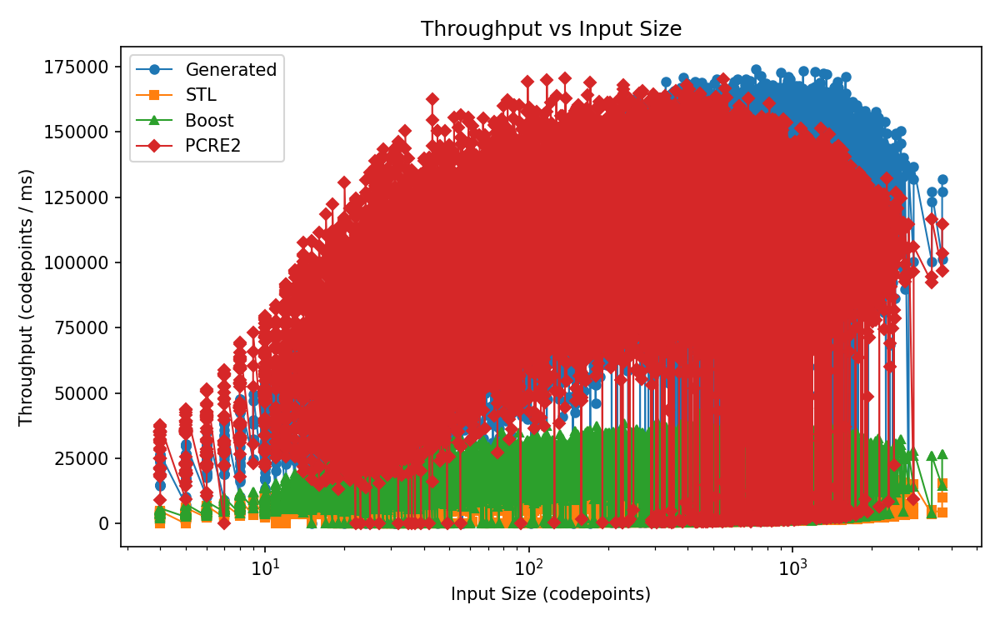

# PCRE to C++ Converter

Converts PCRE regex patterns into standalone C++ split functions for LLM
pretokenization. The generated code is iterative (no stack overflow on large
inputs) and supports Unicode property classes (`\p{L}`, `\p{N}`, `\p{Lu}`,
etc.) that `std::regex` lacks.

## Generating Code

```bash
python pcre_to_cpp.py --pattern "PATTERN" --name NAME [--output FILE]
```

`--pattern` is the PCRE regex. `--name` sets the generated function name
(`<name>_regex_split`). Output goes to stdout if `--output` is omitted.

Example:

```bash
python pcre_to_cpp.py \
    --pattern "'s|'t|'re|'ve|'m|'ll|'d| ?\p{L}+| ?\p{N}+| ?[^\s\p{L}\p{N}]+|\s+(?!\S)|\s+" \
    --name gpt2 \
    --output gpt2_split.cpp
```

Pre-generated files for common tokenizers are in `examples/`.

## Running Tests

Tests compare generated C++ output against PCRE2 on real text from HuggingFace
datasets. Patterns are defined in `config.yaml`.

```bash
python run.py test              # all patterns
python run.py test -n gpt2      # single pattern
```

## Running Benchmarks

```bash
python run.py bench                     # all patterns
python run.py bench -n gpt2             # single pattern
python run.py bench --iterations 100    # more iterations (default: 50)
python run.py bench --rebuild           # force full rebuild
python run.py bench -o results/         # save JSON results
```

Requires: `g++`, `libpcre2-dev`, `libboost-regex-dev`, `pyyaml`, `datasets`.

## Plotting Results

Generate charts from saved benchmark JSON files:

```bash
python run.py plot results/*.json -d results/charts/          # PNG (default)
python run.py plot results/*.json -d results/charts/ -f svg   # SVG
python run.py plot results/*.json --no-show                   # headless
```

Requires: `matplotlib`.

## Benchmark Results

Dataset: wikitext-103-v1 (20k samples), 50 iterations. PCRE2 uses JIT
compilation. STL patterns use ASCII approximations since `std::regex` does not
support Unicode properties.

```
Pattern   | Generated | STL Regex |  Boost  |  PCRE2  | vs STL | vs Boost | vs PCRE2
----------|-----------|-----------|---------|---------|--------|----------|--------
gpt2      |   5412ms  |  50295ms  | 29309ms |  6231ms |  9.3x  |   5.4x   |  1.2x
llama3    |   4587ms  |  91146ms  | 50187ms |  6165ms | 19.9x  |  10.9x   |  1.3x
gpt4o     |   6757ms  |  59696ms  | 25654ms |  6898ms |  8.8x  |   3.8x   |  1.0x
```

Zero token mismatches against PCRE2 across all patterns.





## Documentation

See [design.md](design.md) for supported PCRE features, generated code
structure, and required C++ helpers.
