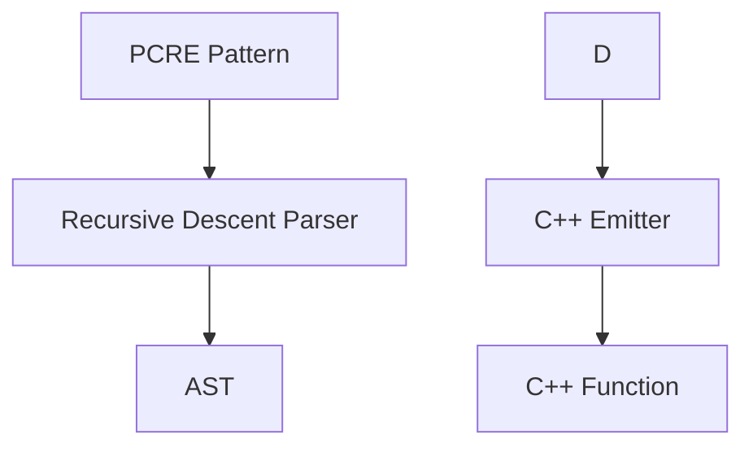

# PCRE to C++ Converter

Converts PCRE regex patterns into standalone C++ functions for LLM pretokenization. Generates iterative matching code that avoids `std::regex` stack overflow on large inputs.



## Usage

```bash
python pcre_to_cpp.py --pattern "PATTERN" --name "NAME" [--output FILE]
```

Example:
```bash
python pcre_to_cpp.py \
    --pattern "'s|'t|'re|'ve|'m|'ll|'d| ?\p{L}+| ?\p{N}+| ?[^\s\p{L}\p{N}]+|\s+(?!\S)|\s+" \
    --name "gpt2" \
    --output gpt2_split.cpp
```

## Running Tests

```bash
python test.py -c tests.yaml -v
python test.py -c tests.yaml -v -n pattern_name  # run specific test
```

## Running Benchmarks

```bash
python benchmark.py -c benchmarks.yaml -v
python benchmark.py -c benchmarks.yaml -v -n benchmark_name  # run specific benchmark
```

## Documentation

See [design.md](design.md) for supported PCRE features, generated code structure, and required C++ helpers.
