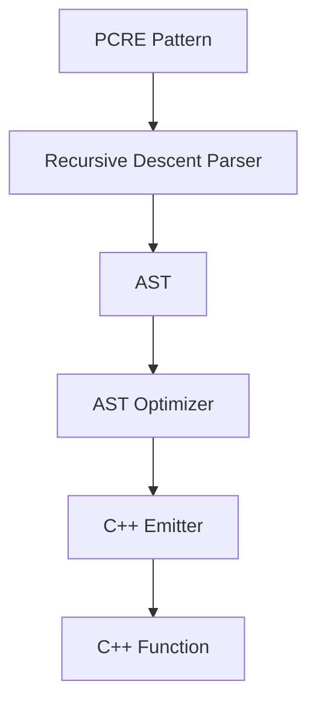

# PCRE to C++ Converter - Design Document

## Overview

Converts PCRE patterns into standalone C++ functions for LLM pretokenization. Generates iterative matching code that avoids `std::regex` stack overflow on large inputs.

## Architecture



## Parser

### Grammar

```
pattern     → alternation
alternation → sequence ('|' sequence)*
sequence    → term+
term        → atom quantifier?
atom        → literal | escape | charclass | group | '.' | anchor
quantifier  → ('*' | '+' | '?' | '{n}' | '{n,}' | '{n,m}') modifier?
modifier    → '?'           # lazy (shortest match first)
            | '+'           # possessive (no backtracking)
group       → '(' pattern ')'
            | '(?:' pattern ')'      # non-capturing
            | '(?i:' pattern ')'     # case-insensitive
            | '(?=' pattern ')'      # positive lookahead
            | '(?!' pattern ')'      # negative lookahead
charclass   → '[' '^'? cc_item* ']'
cc_item     → literal | escape | range
escape      → '\' (special | unicode_cat | predefined)
```

### AST Nodes

```python
LiteralChar(char)           # 'a', '1'
CharClass(items, negated)   # [a-z], [^0-9]
UnicodeCategory(cat, neg)   # \p{L}, \P{N}
Predefined(name)            # \s, \d, \w
SpecialChar(char)           # \r, \n, \t
AnyChar()                   # .
Quantifier(child, min, max, greedy, possessive)  # *, +, ?, {n,m}, *?, *+
Alternation(alternatives)   # a|b|c
Sequence(children)          # abc
GroupNode(child, flags)     # (...), (?:...), (?i:...)
Lookahead(child, positive)  # (?=...), (?!...)
Anchor(type)                # ^, $
```

## AST Optimizer

Runs transformations until fixed point:

1. **Sequence flattening**: `Seq([Seq([a, b]), c])` → `Seq([a, b, c])`
2. **Alternation to CharClass**: `a|b|c` → `[abc]`
3. **Common prefix extraction**: `abc|abd` → `ab(c|d)`

## Supported PCRE Features

| Feature | Syntax |
|---------|--------|
| Literals | `a`, `\.`, `\\` |
| Character classes | `[a-z]`, `[^0-9]` |
| Unicode categories | `\p{L}`, `\P{N}`, `\p{Han}` |
| Predefined classes | `\s`, `\d`, `\w`, `\S`, `\D`, `\W` |
| Special escapes | `\r`, `\n`, `\t`, `\xNN` |
| Any character | `.` |
| Quantifiers | `*`, `+`, `?`, `{n}`, `{n,m}`, `{n,}` |
| Lazy quantifiers | `*?`, `+?`, `??`, `{n,m}?` |
| Possessive quantifiers | `*+`, `++`, `?+`, `{n,m}+` |
| Alternation | `a\|b` |
| Groups | `(...)`, `(?:...)`, `(?i:...)` |
| Lookahead | `(?=...)`, `(?!...)` |
| Anchors | `^`, `$` |

### Not Supported

| Feature | Syntax |
|---------|--------|
| Lookbehind | `(?<=...)`, `(?<!...)` |
| Backreferences | `\1`, `\2` |
| Named groups | `(?P<name>...)` |
| Atomic groups | `(?>...)` |
| Recursion | `(?R)` |
| Conditionals | `(?(cond)...)` |

## Unicode Categories

| Category | C++ Condition |
|----------|---------------|
| `\p{L}` | `flags.is_letter` |
| `\p{N}` | `flags.is_number` |
| `\p{P}` | `flags.is_punctuation` |
| `\p{S}` | `flags.is_symbol` |
| `\p{M}` | `flags.is_accent_mark` |
| `\p{Z}` | `flags.is_separator` |
| `\p{C}` | `flags.is_control` |
| `\p{Lu}` | `is_letter && is_uppercase` |
| `\p{Ll}` | `is_letter && is_lowercase` |
| `\p{Han}` | `unicode_cpt_is_han(cpt)` |

Unrecognized `\p{Foo}` emits `unicode_cpt_is_foo(cpt)` for you to implement.

## Generated Code

```cpp
static std::vector<size_t> unicode_regex_split_NAME(
    const std::string & text,          // UTF-8 input
    const std::vector<size_t> & offsets // chunk sizes (or {text.length()} initially)
);  // Returns new chunk sizes
```

### Required Helpers

```cpp
std::vector<uint32_t> unicode_cpts_from_utf8(const std::string & utf8);
unicode_cpt_flags unicode_cpt_flags_from_cpt(uint32_t cpt);
uint32_t unicode_tolower(uint32_t cpt);
bool unicode_cpt_is_han(uint32_t cpt);  // if using \p{Han}

struct unicode_cpt_flags {
    uint16_t is_undefined   : 1;
    uint16_t is_number      : 1;
    uint16_t is_letter      : 1;
    uint16_t is_separator   : 1;
    uint16_t is_accent_mark : 1;
    uint16_t is_punctuation : 1;
    uint16_t is_symbol      : 1;
    uint16_t is_control     : 1;
    uint16_t is_whitespace  : 1;
    uint16_t is_lowercase   : 1;
    uint16_t is_uppercase   : 1;
    uint16_t is_nfd         : 1;
    uint16_t as_uint() const;
};
```

## Usage

```bash
python pcre_to_cpp.py --pattern "PATTERN" --name "NAME" [--output FILE]

# Example: GPT-2 tokenizer
python pcre_to_cpp.py \
    --pattern "'s|'t|'re|'ve|'m|'ll|'d| ?\p{L}+| ?\p{N}+| ?[^\s\p{L}\p{N}]+|\s+(?!\S)|\s+" \
    --name "gpt2"
```

## Matching Strategy

Alternatives are tried in order; first match wins. Quantifiers use simple loops when possible, or iterative backtracking when followed by lookaheads or other patterns.

For `\s+(?!\S)` on `"  x"`:
1. `\s+` greedily matches both spaces
2. `(?!\S)` fails (next char is `x`)
3. Backtrack: `\s+` gives up one space
4. `(?!\S)` succeeds (next char is whitespace)

Backtracking uses a shared pre-allocated stack with base index tracking - one allocation per function call, O(1) cleanup via `resize()`.

## Limitations

- No lookbehind (would require backward scanning)
- No backreferences (would need capture tracking)
- `\p{Lt}` approximated as uppercase
- Only `\p{Han}` script category implemented
